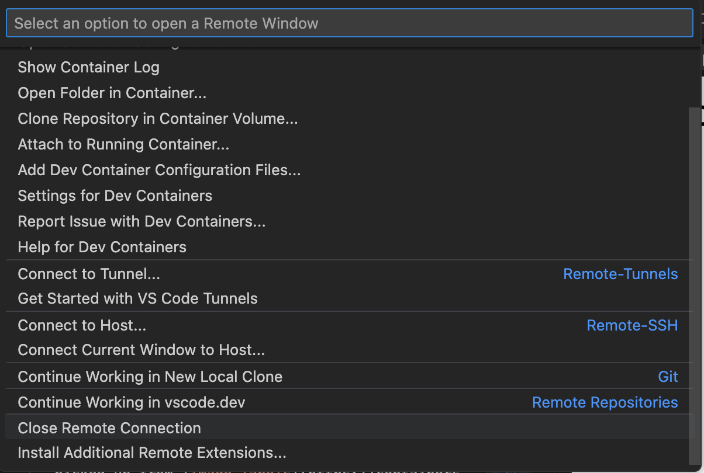

# 介紹
這是使用dev container作為本機開發環境的範例專案

# Dev container優點
使用 VS Code Dev Container 有以下優點：

1. 一致的開發環境：Dev Container 可以在容器中提供與主機相同的開發環境，包括所需的程式庫、工具和環境變數。這樣可以確保團隊成員使用的開發環境都是一致的，從而避免因為開發環境的不同而引起的問題。

2. 快速的環境設置：使用 Dev Container 可以快速地設置開發環境，因為你只需要在 VS Code 中設定一些配置，然後啟動 Dev Container 即可。這樣可以節省許多時間，特別是當你需要在不同的機器上設置相同的環境時。

3. 安全性：使用 Dev Container 可以確保開發環境與主機是分離的。這樣可以減少主機被攻擊的風險，同時也可以保護開發環境中的資料和程式碼。

4. 易於維護：Dev Container 通常是基於容器技術實現的，因此可以很容易地進行部署和維護。如果需要更新開發環境，只需要更新容器映像檔即可，不需要在主機上進行設置。

總之，使用 VS Code Dev Container 可以讓開發環境的設置更加容易和一致，同時也可以提高開發的安全性和可維護性。
# 前置作業
請於本機安裝好以下三個東西
- [vscode](https://code.visualstudio.com/download)
- [Docker Desktop](https://www.docker.com/products/docker-desktop/)
- [vscode extension - Remote Development](https://marketplace.visualstudio.com/items?itemName=ms-vscode-remote.vscode-remote-extensionpack)

# 如何快速體驗dev container
先使用`F1` 叫出命令視窗，再輸入`dev containers:try a dev container sample`

選擇要體驗哪種程式語言，我是選擇Python

接著一直進入下一步，即可進行container中
ps：第一次因為要build image，會花比較多時間

可以根據readme.md中的教學，執行語法啟動python service

打開broswer顯示結果

若要退出dev container的話，則可以點左下角的綠色圖示

選擇`close remote connection`

# 如何在自己的專案中加入dev container

# 如何傳變數給container

# Reference 
- https://www.tpisoftware.com/tpu/articleDetails/2575
